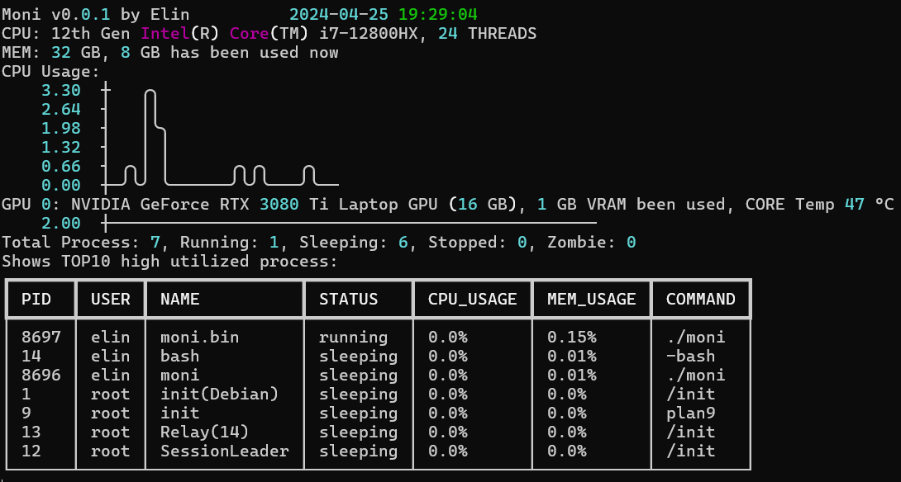

<h1 style="text-align:center">Moni([aɪ])</h1>

## README [中](README_zh.md) | [EN](README.md)



### What is Moni?

Moni is a simple,easy to use and lightweight monitoring tool for Linux system.  
It provides a human readable GUI and rich texted information about the system.
Whether acrros *CPU,RAM and NVIDIA CUDA GPUs* information(support multi GPU ***maybe*** because i have no budget for multi GPU system to test T_T ). 

### Why Moni?

Moni has been written in Python,it's friendly for the developer using both NVIDIA CUDA GPU,Python and Linux to hands on.   
Also the core component and APIs of Moni is relys on your machine system libraries,that means Moni just a `API Caller` and `Data visualizer`.

### Setup for develop and contributing Moni
I suggest you using env manager like `conda` and `virtualenv`.

Here is the below version of software SDKs version using for Moni development:
- Python 3.10
- CUDA Driver 11.8
- Git
- GCC111

Cloning the Moni repo and install the dependencies:
```bash
git clone https://github.com/ElinLiu0/Moni.git
cd Moni
pip install -r requirements.txt
```
> #### For Conda User
> Don't forget to install `libpython-static` package for building,otherwise Nuitka will throw an error for that.  
> You can install it by:
> ```bash
> conda install libpython-static -y
> ```


### How to build Moni?

Once you clone the Moni repo,you will see a `build.sh` that using Nuitka compiler.  
I usggest you using GCC11 for building(because i'm using that).

Once you have setup the Python and GCC,then you can run `build.sh` to build the Moni binary file.  
Since this building script using some permision of `sudo`,you may need to type your password for these operations.

Once building done,Moni will automatically installed at `/usr/local/bin`,which means you no need to to specify the path for running Moni into system variables.


