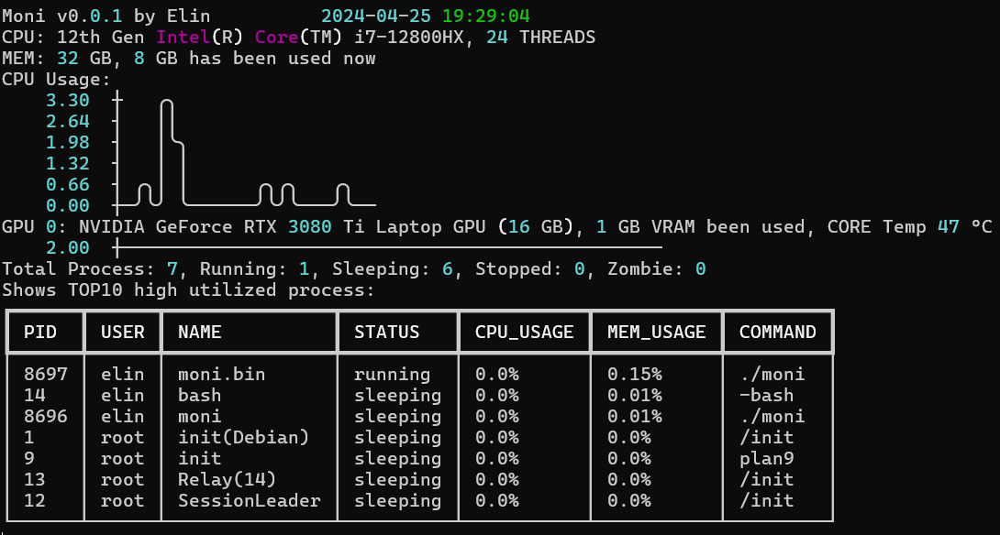

<h1 style="text-align:center">Moni([aɪ])</h1>

## README [中](README_zh.md) | [EN](README.md)



### 什么是Moni?

Moni是一个简单易用的轻量级Linux系统监控工具。
它提供了一个人类可读的GUI，以及由富文本构建的终端信息系统。  
包含了CPU,RAM和NVIDIA CUDA GPU的信息(***可能***支持多GPU，因为穷，没钱买多卡T_T)

### 为什么用Moni?

Moni是用Python编写的，对于使用NVIDIA CUDA GPU,Python和Linux的开发人员来说非常友好。 
此外，Moni的核心组件和API依赖于您的系统库，这意味着Moni只是一个`API调用器`和`数据可视化器`。

### 开始进行Moni软件环境搭建
我建议您使用`conda`和`virtualenv`这样的环境管理器。

以下是用于Moni开发的软件SDKs及版本:
- Python 3.10
- CUDA Driver 11.8
- Git
- GCC111

克隆Moni Git仓库并下载Python依赖:
```bash
git clone https://github.com/ElinLiu0/Moni.git
cd Moni
pip install -r requirements.txt
```
> #### 针对Conda用户
> 不要忘记安装`libpython-static`包，否则Nuitka会因为找不到这个包而在执行构建时报错！  
> 可通过：
> ```bash
> conda install libpython-static -y
> ```  
> 进行安装。

### 如何构建你的Moni？
在克隆了Moni仓库，您将看到一个使用Nuitka编译器的`build.sh`。
我建议您使用GCC11进行构建（别问，我就是我用，我跑，我没报错）。

设置好Python和GCC后，就可以运行`build.sh`来构建Moni二进制文件了。
由于此构建脚本使用了`sudo`的某些权限，因此您可能在此期间需要输入一回`sudoer`的密码。

构建完成后，Moni将自动安装在`/usr/local/bin`中，这意味着您无需指定将Moni运行路径添加到系统变量中的路径。


